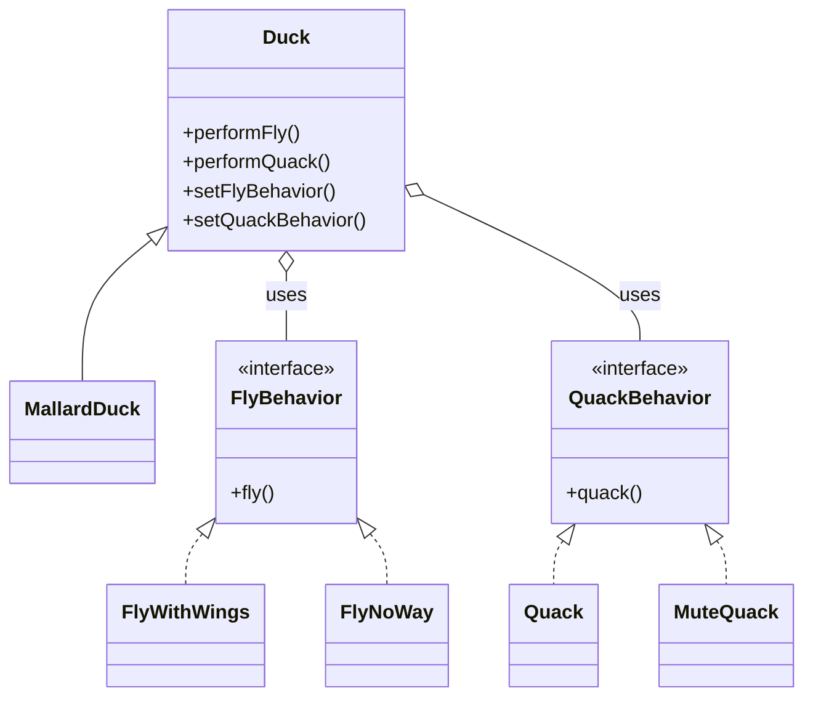

# Java-Book-DesignPattern

### Chapter 1. Strategy Pattern

```mermaid
classDiagram
    class Duck {
        +performFly()
        +performQuack()
        +setFlyBehavior()
        +setQuackBehavior()
    }
    class MallardDuck
    Duck <|-- MallardDuck

    class FlyBehavior {
        <<interface>>
        +fly()
    }
    class FlyWithWings
    class FlyNoWay
    FlyBehavior <|.. FlyWithWings
    FlyBehavior <|.. FlyNoWay

    class QuackBehavior {
        <<interface>>
        +quack()
    }
    class Quack
    class MuteQuack
    QuackBehavior <|.. Quack
    QuackBehavior <|.. MuteQuack

    Duck o-- FlyBehavior : uses
    Duck o-- QuackBehavior : uses
```