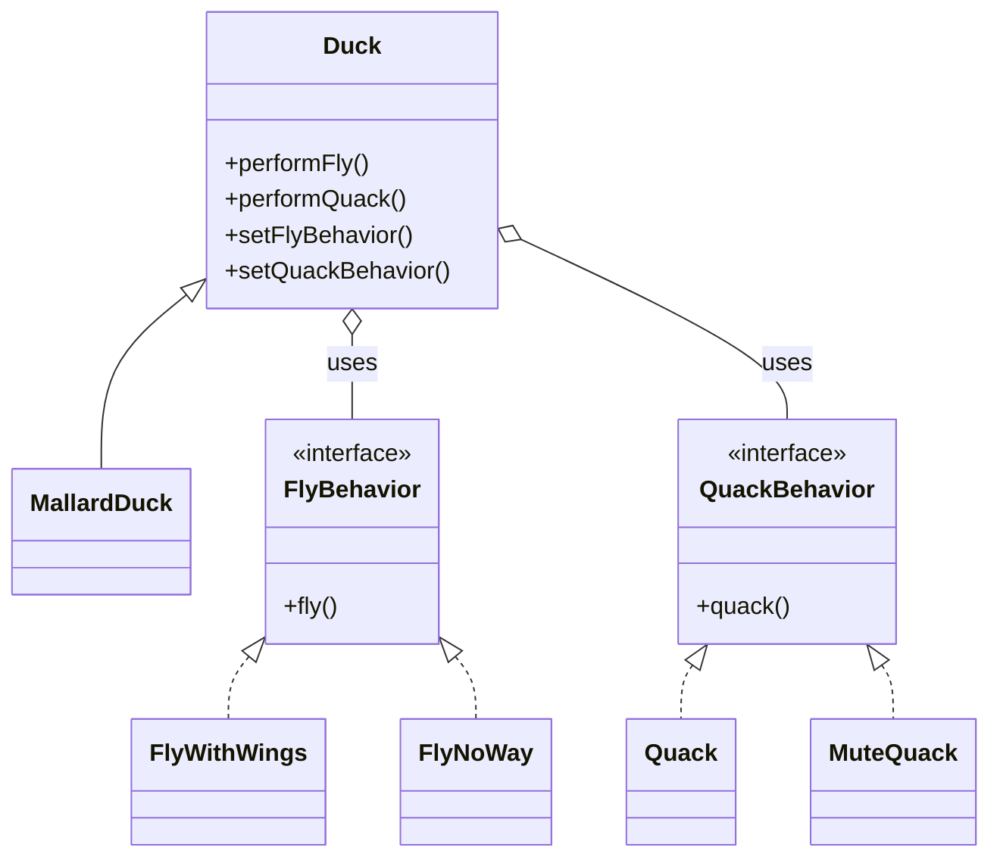
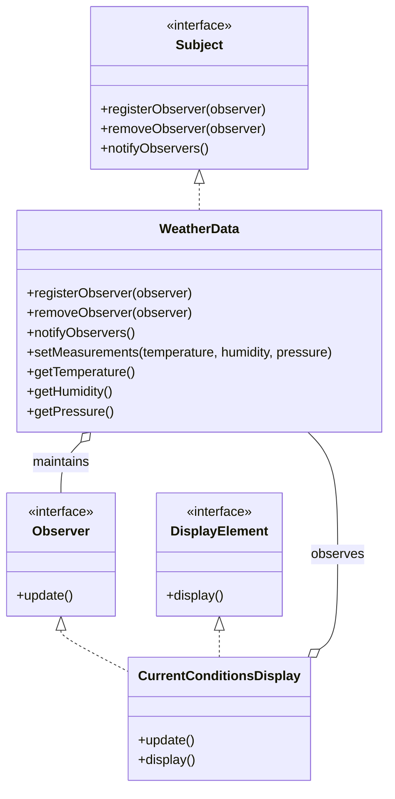
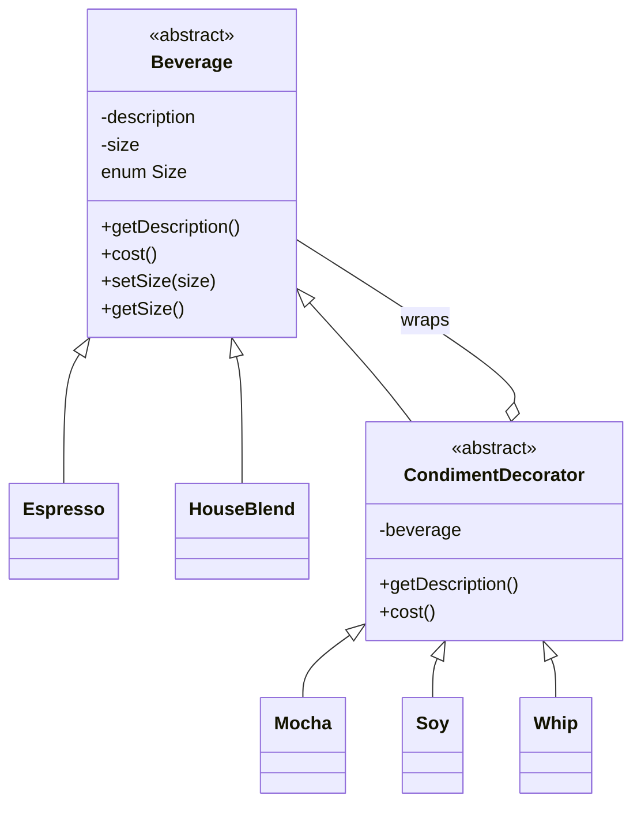

# Java-Book-DesignPattern

### Chapter 1. Strategy Pattern

```mermaid
classDiagram
    class Duck {
        +performFly()
        +performQuack()
        +setFlyBehavior()
        +setQuackBehavior()
    }
    class MallardDuck
    Duck <|-- MallardDuck

    class FlyBehavior {
        <<interface>>
        +fly()
    }
    class FlyWithWings
    class FlyNoWay
    FlyBehavior <|.. FlyWithWings
    FlyBehavior <|.. FlyNoWay

    class QuackBehavior {
        <<interface>>
        +quack()
    }
    class Quack
    class MuteQuack
    QuackBehavior <|.. Quack
    QuackBehavior <|.. MuteQuack

    Duck o-- FlyBehavior : uses
    Duck o-- QuackBehavior : uses
```

### Chapter 2. Observer Pattern

```mermaid
classDiagram
    class Subject {
        <<interface>>
        +registerObserver(observer)
        +removeObserver(observer)
        +notifyObservers()
    }
    class WeatherData {
        +registerObserver(observer)
        +removeObserver(observer)
        +notifyObservers()
        +setMeasurements(temperature, humidity, pressure)
        +getTemperature()
        +getHumidity()
        +getPressure()
    }
    Subject <|.. WeatherData

    class Observer {
        <<interface>>
        +update()
    }
    class CurrentConditionsDisplay {
        +update()
        +display()
    }
    Observer <|.. CurrentConditionsDisplay

    class DisplayElement {
        <<interface>>
        +display()
    }
    DisplayElement <|.. CurrentConditionsDisplay

    WeatherData o-- Observer : maintains
    CurrentConditionsDisplay o-- WeatherData : observes
```

### Chapter 3. Decorator Pattern

```mermaid
classDiagram
    class Beverage {
        <<abstract>>
        +getDescription()
        +cost()
        +setSize(size)
        +getSize()
        -description
        -size
        enum Size
    }
    class Espresso
    class HouseBlend
    Beverage <|-- Espresso
    Beverage <|-- HouseBlend

    class CondimentDecorator {
        <<abstract>>
        +getDescription()
        +cost()
        -beverage
    }
    CondimentDecorator <|-- Mocha
    CondimentDecorator <|-- Soy
    CondimentDecorator <|-- Whip

    class Mocha
    class Soy
    class Whip

    Beverage <|-- CondimentDecorator
    CondimentDecorator o-- Beverage : wraps
```