# Java-Book-DesignPattern

### Chapter 1. Strategy Pattern

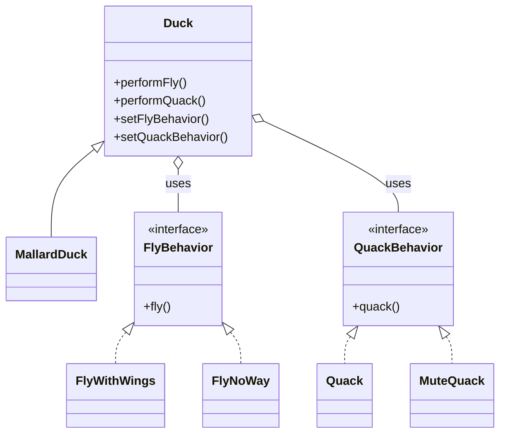

### Chapter 2. Observer Pattern

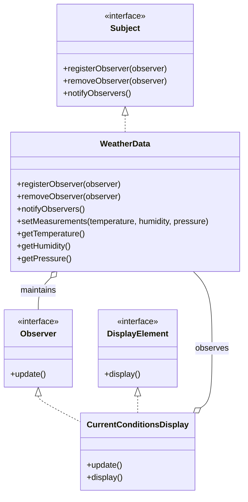

### Chapter 3. Decorator Pattern

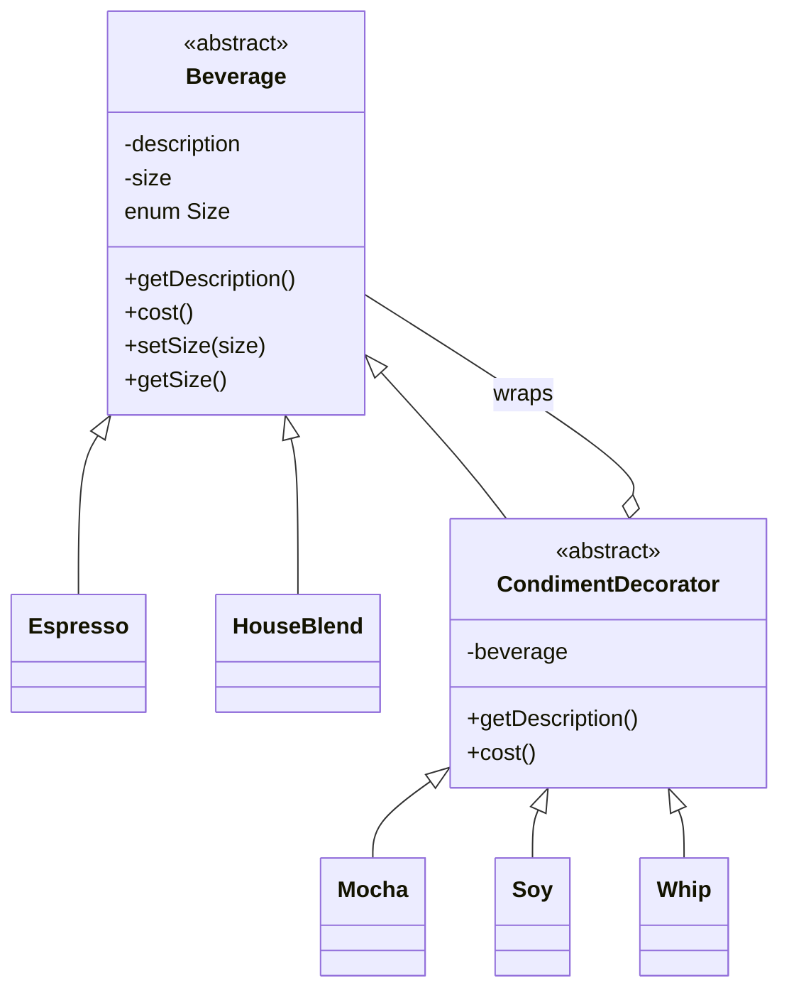

### Chapter 4. Factory Pattern

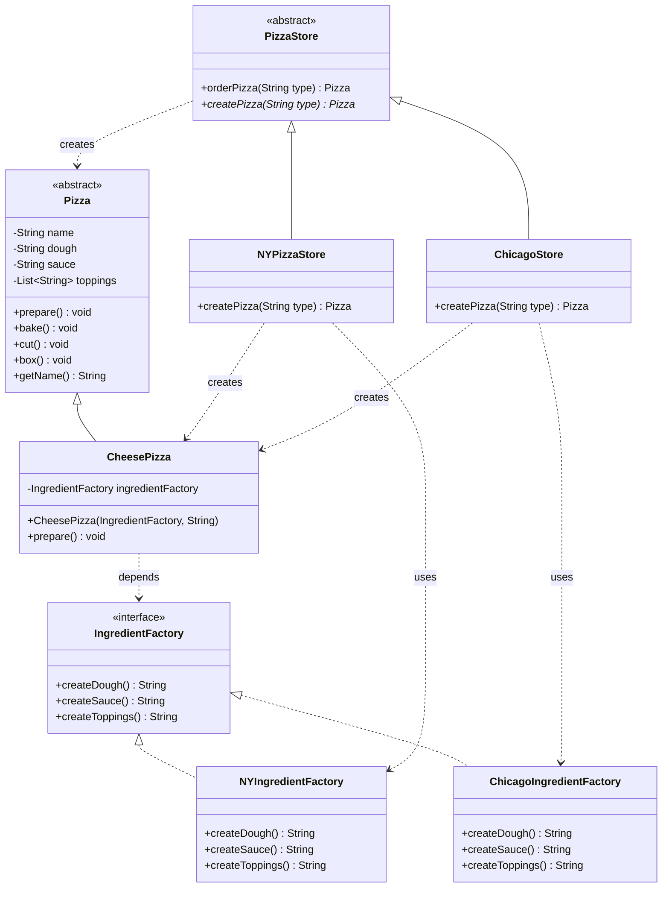

### Chapter 5. Singleton Pattern

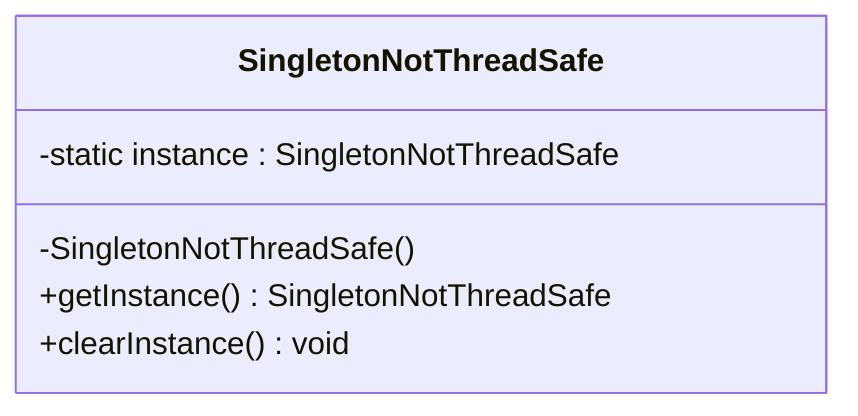

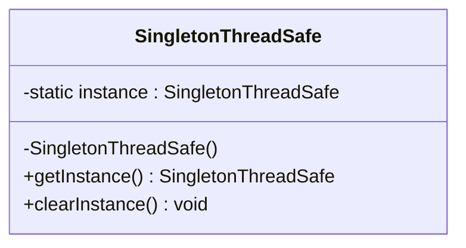

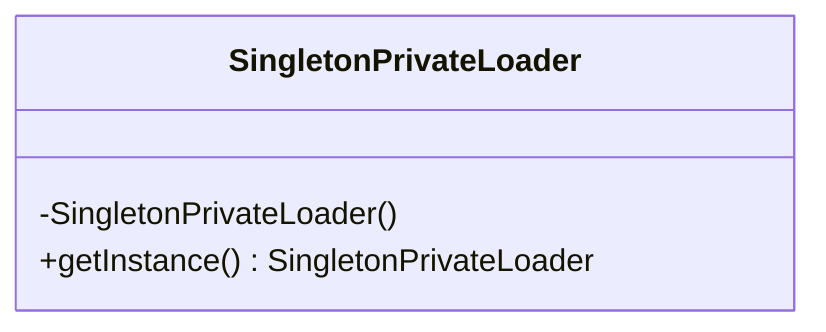

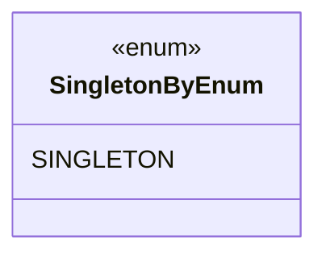

### Chapter 6. Command Pattern

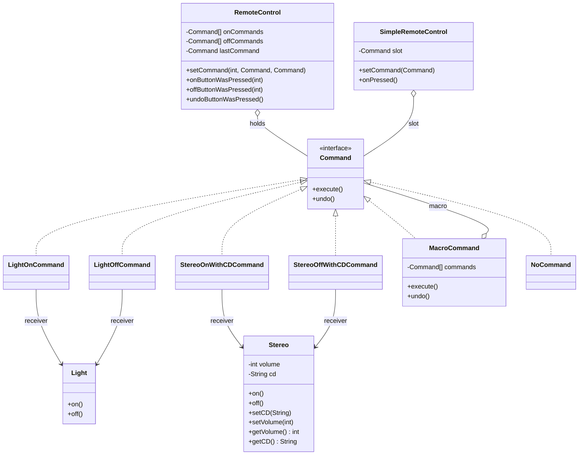

### Chapter 7. Adapter Pattern

#### TurkeyToDuckAdapter

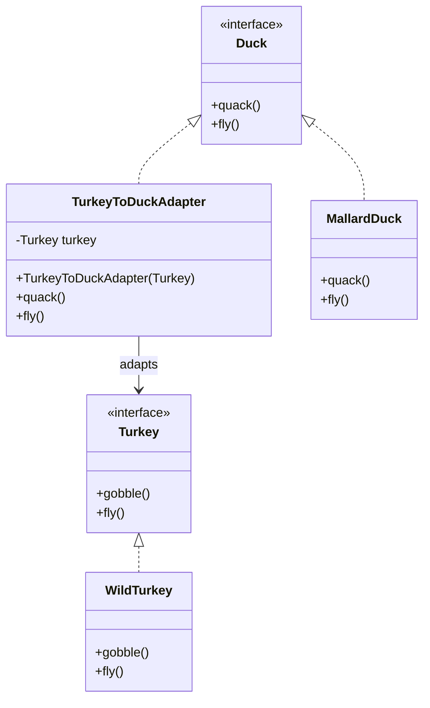

#### EnumerationIterator

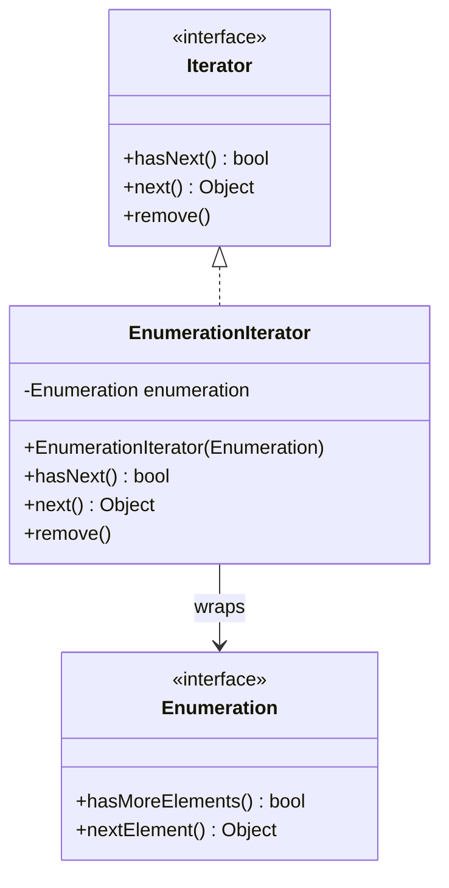

#### HomeTheaterFacade

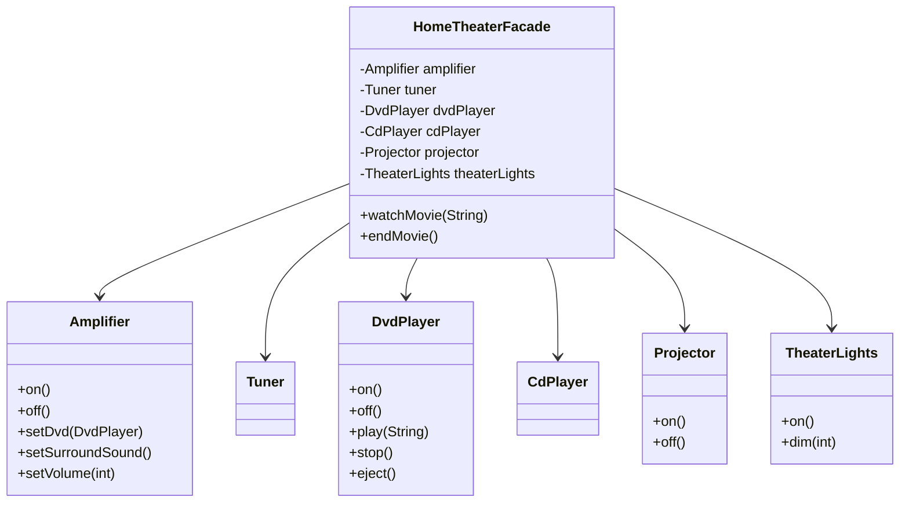
